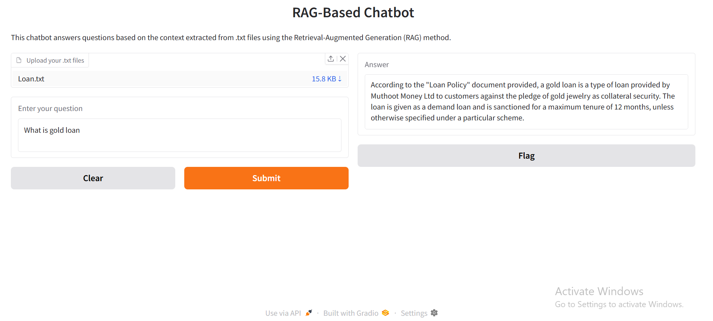

# Gold-Loan-Chatbot

```
# 🔍 RAG-Based Chatbot with LangChain, Groq & Gradio

This is a Retrieval-Augmented Generation (RAG) chatbot that answers questions based on content from `.txt` files you upload. It uses:

- 🧠 [LangChain](https://www.langchain.com/) for orchestration
- ⚡ [Groq](https://groq.com/) for fast LLM inference (LLaMA3-8B)
- 🧩 HuggingFace embeddings for vector search
- 🖼️ [Gradio](https://gradio.app/) for an interactive UI

---

## 💡 Features

- Upload `.txt` files as knowledge base
- Ask any question about the uploaded content
- Answers are retrieved using a vector search + LLM
- Clean, easy-to-use interface via Gradio

---

## 🧰 Setup Instructions

### 1. Clone the Repository

```bash
git clone https://github.com/yourusername/rag-groq-chatbot.git
cd rag-groq-chatbot
```

### 2. Install Dependencies

```bash
pip install -r requirements.txt
```

### 3. Add Your API Key

Create a `.env` file in the root folder and add your [Groq API key](https://console.groq.com/keys):

```env
GROQ_API_KEY=gsk_your_api_key_here
```

> ⚠️ Never hardcode your API key in the code. Always use environment variables.

### 4. Run the App

```bash
python app.py
```

Then open the Gradio app in your browser.

---

## 📦 File Structure

```
rag-groq-chatbot/
│
├── app.py              # Main application file
├── requirements.txt    # All Python dependencies
├── .env                # Secret keys (not tracked by Git)
└── README.md           # This file
```

---

## 🤖 Model & Tools Used

- **LLM**: `llama3-8b-8192` (served by Groq)
- **Embedding**: `all-MiniLM-L12-v2` (HuggingFace)
- **Vectorstore**: In-memory FAISS (via LangChain)
- **Frontend**: Gradio UI

---

## 💬 Example Use Case

Upload files like:
```
customer_faq.txt
technical_docs.txt
policy_terms.txt
```

Then ask:
> “What is the return policy for damaged products?”

💥 You'll get a precise answer generated by the LLM based on your files.

---
## 📸 Example Output

Here is an example of the output you can expect from the API:



---
